# Insemi TimeSheet

Welcome to **Insemi TimeSheet**! This is an employee management solution for any corporate structure. 

## INSTRUCTIONS FOR INSTALLATION

Insemi TImeSheet is buit on a combination of Python's Django library to handle the full stack web development side and the JavaScript React.js library for the frontend development side. 

### Step One: Downloading the Code Base

[GitHub Repository for Insemi TimeSheet](https://github.com/arnyboy101/InsemiTimeSheet)


If you regularly use **GitHub Desktop** then choose the Open with GitHub Desktop option. 

If you do not use GitHub Desktop or are not comfortable with using that option, you can Download ZIP. Extract the compressed zip folder using your preferred decompression software. 

### Step Two: Programming Instructions

Get Microsoft's Visual Studio Code editor [here](https://code.visualstudio.com/)

Download the latest version of Python [here](https://www.python.org/downloads/)

Download your preferred version of Node.js [here](https://nodejs.org/en/download/)

Open Visual Studio Code and download the **JavaScript and Python extension**


Click on the terminal tab and select new terminal as shown above.

Type `python` in your terminal and if the below image shows up, the installation has been successful.


Type `Cntrl + Z` and click enter to re-enter the terminal.

Next type the following line into the terminal
```
py get-pip.py
```

Once pip in successfully installed, install `Django` using the following statement 
```
pip install django djangorestframework
```
Enter the following statements to install the remaining dependencies.
```
pip install mysqlclient
```
```
pip install django_mysql
```
```
pip install django-crispy-forms 
```
```
pip install django-cors-headers
```
```
pip install djangorestframework-jwt
```

**Here are the various facets of our program and where it can be improved**

## Login and Registration

### Registration
Can be found at http://127.0.0.1:8000/users/register/

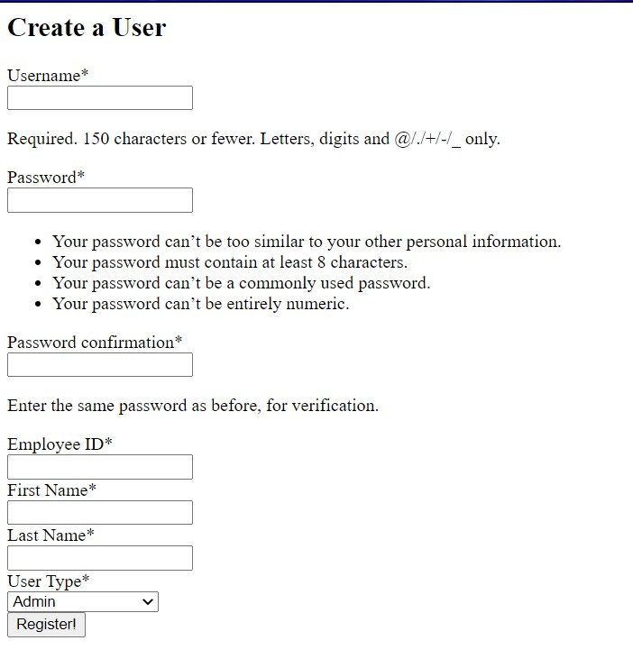
 
 - Once registered, another user cannot use the same username or Employee ID
 - *Improvements* - Front-end needs to look more polished and approachable

 ### Login

 If not directly redirected from the registration page, you can directly login from http://127.0.0.1:8000/auth/

 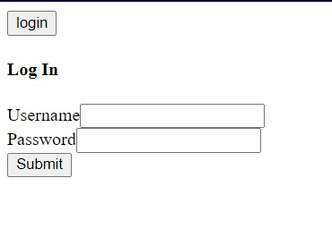

 The username will be authenticated and you will be redirected to the next navigation screen.

 

 
 
## Home Screen
If you choose the **Proceed to Home** option in the navigation screen, you will be redirected to the Home Screen.

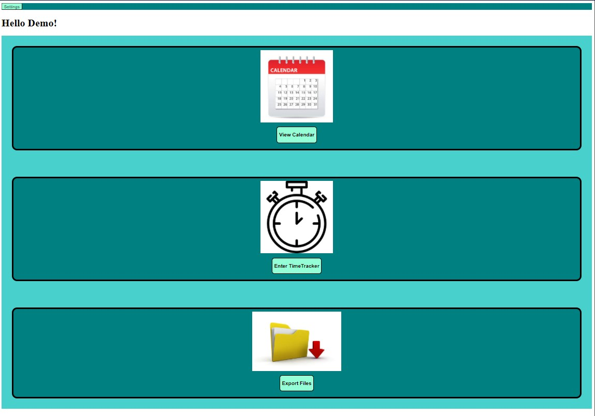

- Here you will be presented with three options. **View Calendar**,**Enter TimeTracker** and **Export Files**
- *Improvements* - 
    * Placeholder images need to be replaced with licensed/original clip-art or illustrations
    * Notice Board needs to be added (to view on-going and upcoming meetings, messages and leave approvals from Higher Level Users and other notifications)

If you click the settings button in the top-left corner. A menu page will open up at http://127.0.0.1:8000/users/settings/

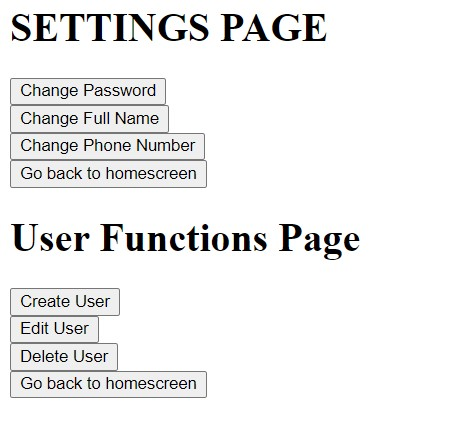

* *Improvements* - 
    * None of the buttons are operational, functionality needs to be added.
    * Frontend GUI needs to be improved.

## Calendar
The *View Calendar* button on the Home Screen will redirect you to http://127.0.0.1:8000/calendar/

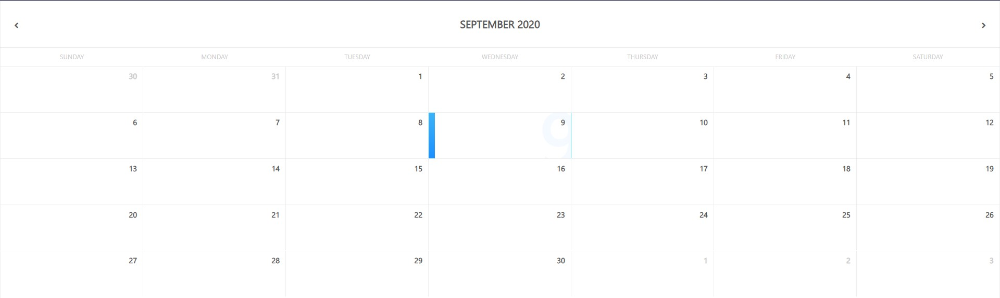

A responsive calendar with little CSS-based animations. It acts as the controlling frontend to access the TimeSheet.

- *Improvements* - 
    - Multicolored flags could be added to show reminders for activies and project deadlines.
    - Color of the days could be changed based on attendance.


## TimeSheet
Below the calendar there are two panels. The first is an Activity Report.

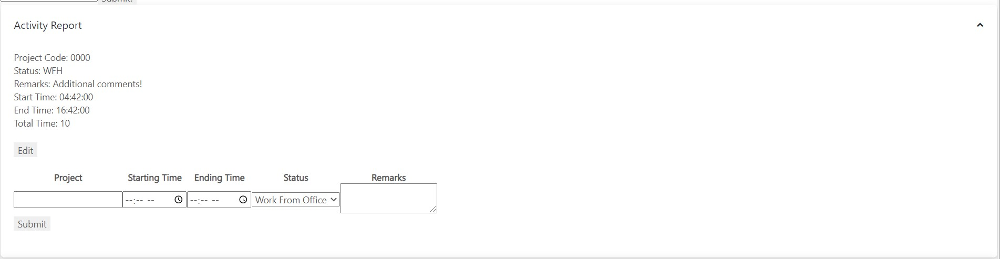

The next panel is an entry panel.

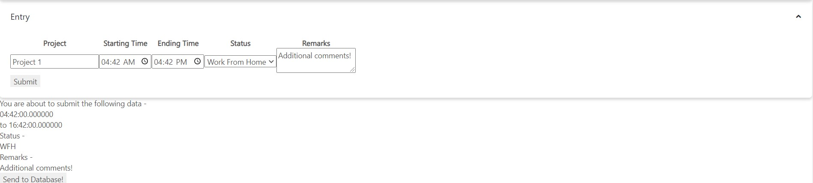

- *Improvements* -
    - Search should be expanded to Name, Project, Manager, Employee ID etc
    - Higher Level Users should be able to view and approve their Lower Level Users' TimeSheets after the search. 
    - Edit button should edit the actual POST and not create a new one.
    - Project ID should be linked with Projects imported from the Project API.
    - Back to Home Button needs to be added somewhere on the page.


TimeTracker

Upon clicking **Enter TimeTracker** , you will be redirected to the TimeTracker screen.

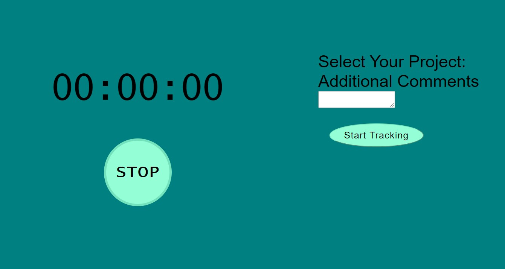

After choosing a project (Implementation needed), and entering Additional Comments, you must click **Start Tracking**. The clock will start ticking.

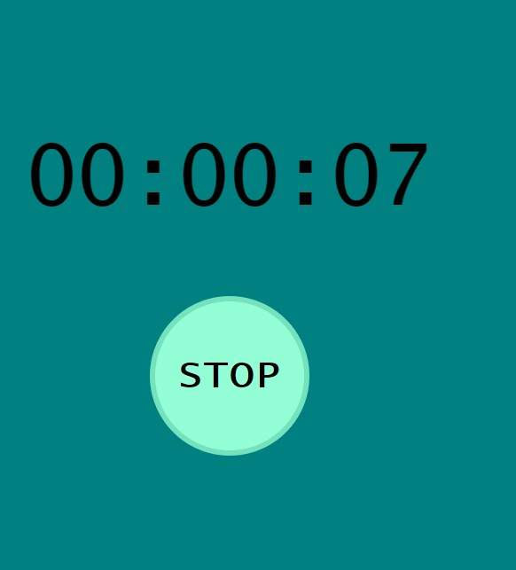

After you are done tracking your time, you must click stop. A confirmation message will appear and a Send to Database panel will show up. 

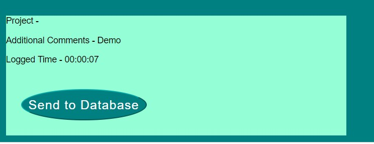

Upon clicking **Send to Database**, the Activity should post (Implementation to be added). 


## Export Files

Upon clicking **Export Files**, you are redirected to the export data page. 

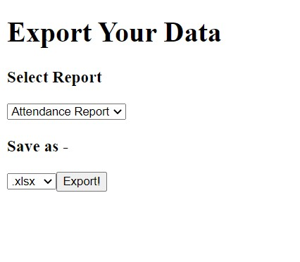

You can select from three report options which will be compiled in real-time based on an inputted-date range (Implementation to be added).

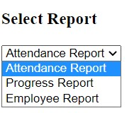

- *Attendance Report* - To show attendance for one or more Lower Level Users.
- *Progress Report* - To show Employee progress on various projects.
- *Employee Report* - To show various projects and progress for each induvidual employee upon request.

## Hierarchy 
### *Unimplemented*
- Hierarchy creator application must be added and must be flexible.
- Predefined permissions for all hierarchies to be created which can then be assigned to different tiers.
- Client must be abe to predefine certain heirarchies and their permissions at the time of customization. 
- Admin can redefine hierarchies and add hierarchies based on permissions.
- Grouping of employees based on their respective managers/HLUs.
- Groups can belong to other groups.
- Employees can be part of multiple groups.

## Notice Board
### *Unimplemented*
- Notice Board functionality and GUI needs to be added on the Home Screen.
- Should function like a notification system.
- Cards for upcoming meetings, project deadlines, TimeSheet approvals and other features should be added.
- Notice board application must be linked with all the other applications.

## Leave System
### *Unimplemented*
- Complete GUI and functionality must be added for Leave System.
- Reasons for leaves must be created and linked to Lower Level Users' calendar.
- Higher Level Users must be able to approve leaves for Lower Level Users.
- Leaves must be classified as emergency or regular application based on date.
- Must be flexible to allow users to select multiple dates and give extra comments as well.
- Restrictions for leaves must be implemented (Limit based on number of days and combination of leaves)

## Client Customization
### *Unimplemented*
- Client must be abe to predefine certain heirarchies and their permissions at the time of customization. 
- Client should be able to add superuser and set admins.
- Client should select whether they want to include timetracker as a feature.

## Higher Level User Features
- View and approve timesheets for Lower Level Users.
- View and approve leave requests for Lower Level Users.
- Create meetings for team/group which appears in calendar of Lower Level Users.
- Create projects and project deadlines from which the Lower Level Users can select while entering data for TimeSheet.
- Can send messages/reminders to Lower Level Users.
