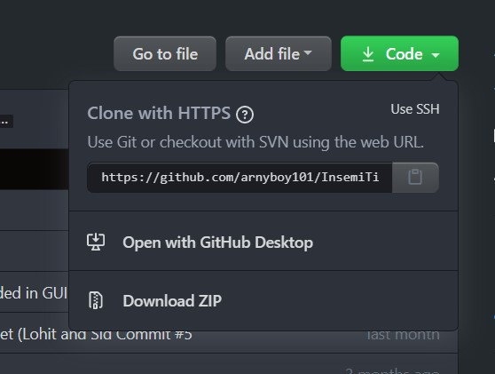
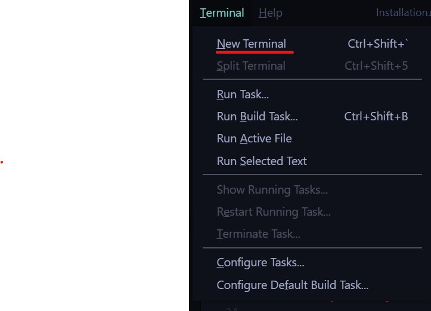
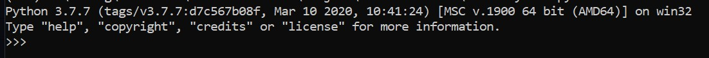

Hi!

# INSTRUCTIONS FOR INSTALLATION

Insemi TImeSheet is buit on a combination of Python's Django library to handle the full stack web development side and the JavaScript React.js library for the frontend development side. 

## Step One: Downloading the Code Base

[GitHub Repository for Insemi TimeSheet](https://github.com/arnyboy101/InsemiTimeSheet)



If you regularly use, **GitHub Desktop** then choose the Open with GitHub Desktop option. 

If you do not use GitHub Desktop or are not comfortable with using that option, you can Download ZIP. Extract the compressed zip folder using your preferred decompression software. 

## Step Two: Programming Instructions

Get Microsoft's Visual Studio Code editor [here](https://code.visualstudio.com/)

Download the latest version of Python [here](https://www.python.org/downloads/)

Download your preferred version of Node.js [here](https://nodejs.org/en/download/)

Open Visual Studio Code and download the **JavaScript and Python extension**



Click on the terminal tab and select new terminal as shown above.

Type `python` in your terminal and if the below image shows up, the installation has been successful.



Type `Cntrl + Z` and click enter to re-enter the terminal.

Next type the following line into the terminal
```
py get-pip.py
```

Once pip in successfully installed, install `Django` using the following statement 
```
pip install django djangorestframework
```
Enter the following statements to install the remaining dependencies.
```
pip install mysqlclient
```
```
pip install django_mysql
```
```
pip install django-crispy-forms 
```
```
pip install django-cors-headers
```
```
pip install djangorestframework-jwt
```


Login


Home Screen


Calendar


TimeSheet


TimeTracker


Export Files


Hierarchy


Notice Board


Leave System


Client Customization


